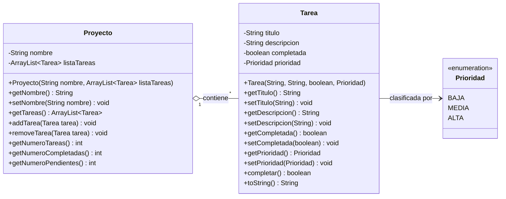

# 📚 Ejercicios de Java — Desarrollo de Interfaces (DDI)


Colección completa de ejercicios prácticos en **Java** desarrollados para el módulo de **Desarrollo de Interfaces (DDI)** en Formación Profesional (Grado Superior).

El repositorio abarca desde los fundamentos del lenguaje (entrada/salida, condicionales, bucles y funciones) hasta conceptos avanzados de **Programación Orientada a Objetos (POO)**, colecciones (`ArrayList`), modelado de relaciones 1:N y enumerados (`enum`).

---

## 📑 Tabla de Contenidos

1. [Estructura del Proyecto](#-estructura-del-proyecto)
2. [Diagrama de Clases](#-diagrama-de-clases)
3. [Guía de Ejercicios](#-guía-de-ejercicios)
   - [Bloque 1: Fundamentos y Funciones (1 - 5)](#bloque-1-fundamentos-y-funciones-ejercicios-1-a-5)
   - [Bloque 2: POO y Clase Tarea (6 - 11)](#bloque-2-poo-y-gestión-de-tareas-ejercicios-6-a-11)
   - [Bloque 3: Relaciones, Estadísticas y Enums (12 - 14)](#bloque-3-relaciones-estadísticas-y-enums-ejercicios-12-a-14)
4. [Requisitos y Ejecución](#-requisitos-y-ejecución)

---

## 📁 Estructura del Proyecto

```text
ejerciciosJava/
├── .gitignore
├── README.md
├── ejerciciosJava.iml
└── src/
    ├── Ejercicio1.java    # Entrada por teclado y cálculo de edad
    ├── Ejercicio2.java    # Cálculo de precios con descuentos
    ├── Ejercicio3.java    # Estructura switch y cálculo de prioridades
    ├── Ejercicio4.java    # Arrays unidimensionales y formateo
    ├── Ejercicio5.java    # Búsqueda secuencial en arrays
    ├── Ejercicio6.java    # Primera versión de la clase Tarea
    ├── Ejercicio7.java    # Método completar() y cambio de estado
    ├── Ejercicio8.java    # Listas dinámicas (ArrayList) y visualización
    ├── Ejercicio9.java    # Eliminación por posición con try-catch
    ├── Ejercicio10.java   # Búsqueda y filtrado por título (contains)
    ├── Ejercicio11.java   # Separación de tareas completadas e incompletas
    ├── Ejercicio12.java   # Modelado de clase Proyecto (relación 1:N)
    ├── Ejercicio13.java   # Estadísticas y métricas del proyecto
    └── Ejercicio14.java   # Enum Prioridad y gestión integral de tareas
```

---

## 🧩 Diagrama de Clases

Modelado de las entidades desarrolladas en los ejercicios avanzados:



---

## 📖 Guía de Ejercicios

### Bloque 1: Fundamentos y Funciones (Ejercicios 1 a 5)

| Ejercicio | Conceptos Clave | Descripción |
| :--- | :--- | :--- |
| **[Ejercicio 1](src/Ejercicio1.java)** | `Scanner`, `hasNextInt()`, I/O | Solicita nombre y edad por consola, valida entrada numérica y calcula la edad futura (+5 años). |
| **[Ejercicio 2](src/Ejercicio2.java)** | Métodos estáticos, operaciones aritméticas | Calcula subtotal, importe de descuento y precio final mediante funciones modulares. |
| **[Ejercicio 3](src/Ejercicio3.java)** | `switch-case`, validación condicional | Clasifica niveles de prioridad numérica (1 a 3) devolviendo su etiqueta descriptiva. |
| **[Ejercicio 4](src/Ejercicio4.java)** | Arrays (`String[]`), bucle `for` | Formatea y numera una lista estática de tareas en una cadena de texto. |
| **[Ejercicio 5](src/Ejercicio5.java)** | Búsqueda lineal, `equalsIgnoreCase` | Busca una tarea por su nombre ignorando mayúsculas/minúsculas y devuelve su índice. |

---

### Bloque 2: POO y Gestión de Tareas (Ejercicios 6 a 11)

| Ejercicio | Conceptos Clave | Descripción |
| :--- | :--- | :--- |
| **[Ejercicio 6](src/Ejercicio6.java)** | Clases, Encapsulamiento, `toString` | Creación de la clase `Tarea` (título, descripción, estado completada) con getters, setters y representación textual. |
| **[Ejercicio 7](src/Ejercicio7.java)** | Modificación de estado | Implementación del método `completar()`, verificando el cambio de estado antes y después. |
| **[Ejercicio 8](src/Ejercicio8.java)** | `ArrayList<Tarea>`, `List.of` | Colecciones dinámicas de tareas y método `mostrarTareas()` con índices. |
| **[Ejercicio 9](src/Ejercicio9.java)** | `remove()`, manejo de excepciones `try-catch` | Borrado seguro de tareas por posición con captura de posibles `IndexOutOfBoundsException`. |
| **[Ejercicio 10](src/Ejercicio10.java)** | Filtrado, `String.contains()` | Búsqueda y filtrado dinámico de tareas cuyo título contiene una subcadena específica. |
| **[Ejercicio 11](src/Ejercicio11.java)** | Algoritmos de separación y filtrado | Métodos para segregar tareas en dos sublistas: completadas e incompletas. |

---

### Bloque 3: Relaciones, Estadísticas y Enums (Ejercicios 12 a 14)

| Ejercicio | Conceptos Clave | Descripción |
| :--- | :--- | :--- |
| **[Ejercicio 12](src/Ejercicio12.java)** | Asociación 1:N, agregación | Clase `Proyecto` que gestiona su propia colección de tareas mediante métodos `addTarea` y `removeTarea`. |
| **[Ejercicio 13](src/Ejercicio13.java)** | Métricas y estadísticas | Métodos de conteo (`getNumeroTareas`, `getNumeroCompletadas`, `getNumeroPendientes`) y generación de resumen visual. |
| **[Ejercicio 14](src/Ejercicio14.java)** | `enum Prioridad`, composición avanzada | Incorporación del tipo enumerado `Prioridad` (`BAJA`, `MEDIA`, `ALTA`) al ciclo de vida completo de cada tarea. |

---

## 🚀 Requisitos y Ejecución

### Requisitos previos
* **Java Development Kit (JDK)**: Versión 11 o superior (recomendado JDK 17 o 21).

### Compilación y ejecución manual
Desde la raíz del proyecto:

```bash
# Compilar todos los ejercicios
javac src/*.java

# Ejecutar cualquier ejercicio (por ejemplo, el Ejercicio 14)
java -cp src Ejercicio14

# Ejecutar el resumen estadístico del Ejercicio 13
java -cp src Ejercicio13
```

---

## 💻 Tecnologías Utilizadas

* **Lenguaje:** Java SE
* **Herramienta de control de versiones:** Git
* **IDE recomendado:** IntelliJ IDEA / Eclipse / VS Code

---

Desarrollado con ❤️ para la asignatura de **Desarrollo de Interfaces**.
